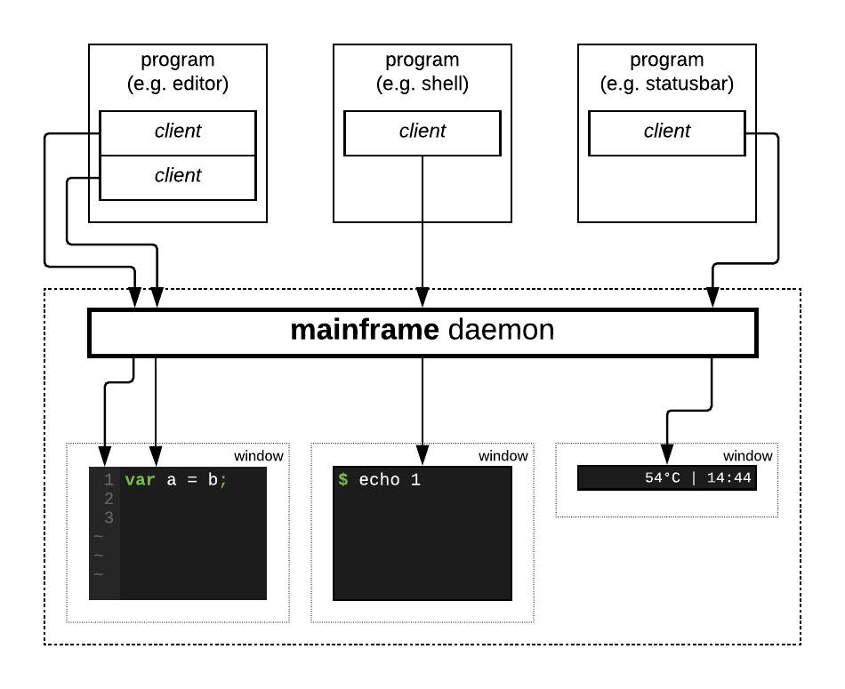

# `mainframe` — not a typical terminal

Typical terminals are actually terminal emulators that abide specifications
from eighties, where control functions are represented by escape sequences
which can only be controlled synchronously in one thread and requires moving
cursor around to display text in different parts of screen. Text that displayed
on screen is not separated by control characters and `cat`-ing binary file will
corrupt that kind of terminals.

Also, due design limitation it is generally not possible to capture `Ctrl+I`
keypress because it translates into tab character due back compatibility for
very old hardware terminals which did not have separate tab key.

<p align="center"></p>

`mainframe` proposes different design. Terminal can be controlled via
unix-socket and multiple clients can control what is displayed on the screen
via text-based or binary-based protocol. So terminal does not process `stdin`,
`stdout` or `stderr` of attached programs at all and all terminal manipulations
should be done via socket connections.

# Use case

`mainframe` is designed to provide generic way to produce text-based UI for
programs. By using different threads which connected to same window it is
possible to change displayed text or color in parallel without need of moving
cursor back and forth.

`mainframe` can be used to create notification windows, statusbars, console
windows, editor frontends and so on.

# Differencies

`mainframe` differencies in comparison with typical terminals:

* uses OpenGL and shaders to draw window contents;

* any key can be captured with up to 4 active modifiers:
  `Ctrl+Shift+Alt+Super+Q`

* allows to separately capture keyboard events and input events, e.g.
  pressing `Shift+1` produce 5 different events: `Shift` press, `Shift+1` (or
  `1` with `shift` modifier) press, `!` char input, `Shift+1` release, `Shift`
  release, in that order;

* area-filling operations can be done via single command to terminal, e.g.
  to draw vim-like line-number column you need to send *one* command;
  to draw same text with classical approach many cursor movement commands
  required;

* does not in fact has cursor concept: any connected client can output anything
  in any position without blocking other clients;

# Installation

```
go get github.com/seletskiy/mainframe/cmd/...
```

# State of development

`mainframe` is in very early development stage. However, it's already can be
used as UI frontend for text applications.

Currently implemented:

- [x] support for TFF fonts;

- [x] lazy renderer, which will render windows only when contents changed;

- [x] daemon mode (`listen` flag) which listens for commands on UNIX socket;

- [x] rendering any number of windows from single daemon instance;

- [x] executing specified commands (`open` command) with automatic window creation
  and attaching running command by opening socket and passing it as file
  descriptor no. `3`;

  For testing, use `mainframe open -- socat FD:3 readline` command to start
  interactive command mode.

- [x] text protocol parser;

- [x] error reporting back to connected client;

- [x] `open` command to open new window;

- [x] `reshape` command to resize/move window;

- [x] `subscribe` command for event subscription and notification for window
  resize and keyboard input;

- [x] partial `put` command for changing text, fg and bg colors;

- [x] `clear` command for clearing parts of screen;

# See also

* [PROTOCOL.md](PROTOCOL.md): UNIX socket protocol format;
* [COMMANDS.md](COMMANDS.md): commands which can be used to control `mainframe`;
* [EVENTS.md](EVENTS.md): events that `mainframe` emits back to client;
